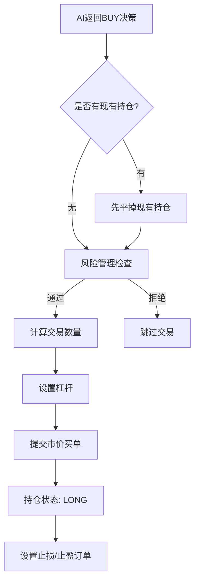
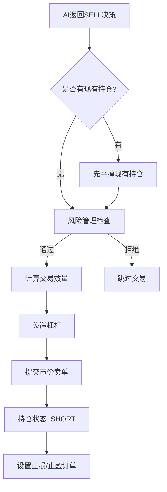
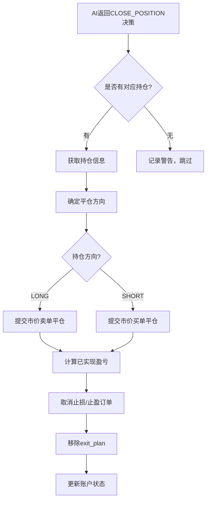
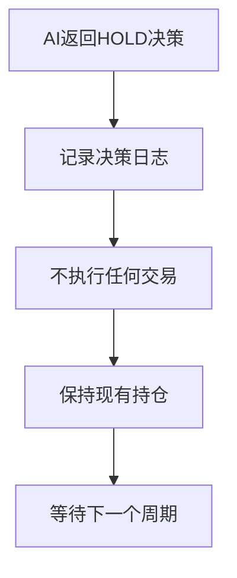
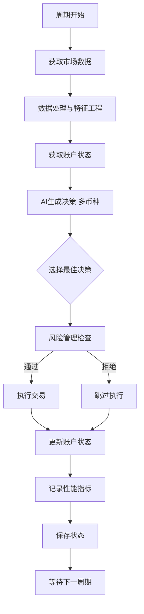

# 交易决策流程与分支说明

## 概述

本文档详细说明 Vibe Trader 系统如何基于 AI 返回的决策结果，执行不同方向的交易操作。系统采用完整的决策-执行-反馈闭环，确保每个交易决策都经过严格的风险管理检查。

## 决策模型

### TradingDecision 数据结构

```python
class TradingDecision(BaseModel):
    rationale: str              # 决策理由
    confidence: float           # 置信度 (0.0-1.0)
    action: str                 # 操作类型: BUY, SELL, HOLD, CLOSE_POSITION
    symbol: Optional[str]       # 交易对符号（如 BTCUSDT）
    quantity_pct: Optional[float] # 仓位百分比 (0.0-1.0)
    exit_plan: Optional[ExitPlan] # 退出计划
    leverage: Optional[int]     # 杠杆倍数
    risk_usd: Optional[float]   # 风险金额
```

### ExitPlan 数据结构

```python
class ExitPlan(BaseModel):
    take_profit: Optional[float]    # 止盈价格
    stop_loss: float                # 止损价格（必填）
    invalidation_conditions: str    # 失效条件描述
```

## 决策类型与执行流程

### 1. BUY 决策（开多仓）

**触发条件：**
- AI 判断市场有上涨潜力
- 技术指标显示看涨信号
- 风险收益比符合要求

**执行流程：**



**关键参数：**
- `action`: "BUY"
- `symbol`: 必填（如 "BTCUSDT"）
- `quantity_pct`: 必填，账户的仓位百分比（如 0.1 = 10%）
- `exit_plan.stop_loss`: 必填，止损价格（必须低于当前价格）
- `exit_plan.take_profit`: 可选，止盈价格
- `leverage`: 杠杆倍数（默认 10x-20x）

**示例：**
```json
{
  "action": "BUY",
  "symbol": "BTCUSDT",
  "confidence": 0.85,
  "quantity_pct": 0.15,
  "rationale": "突破关键阻力位，成交量放大，RSI显示超卖反弹",
  "exit_plan": {
    "stop_loss": 68500,
    "take_profit": 72000,
    "invalidation_conditions": "跌破 68000 或 RSI 超买至 80 以上"
  },
  "leverage": 20,
  "risk_usd": 50
}
```

**执行结果：**
- 开仓方向：LONG（多仓）
- 仓位名义价值：`可用余额 × quantity_pct × leverage`
- 交易数量：`名义价值 / 当前价格`
- 保证金占用：`名义价值 / leverage`

---

### 2. SELL 决策（开空仓）

**触发条件：**
- AI 判断市场有下跌风险
- 技术指标显示看跌信号
- 做空风险收益比符合要求

**执行流程：**



**关键参数：**
- `action`: "SELL"
- `symbol`: 必填（如 "BTCUSDT"）
- `quantity_pct`: 必填，账户的仓位百分比
- `exit_plan.stop_loss`: 必填，止损价格（必须高于当前价格）
- `exit_plan.take_profit`: 可选，止盈价格
- `leverage`: 杠杆倍数

**示例：**
```json
{
  "action": "SELL",
  "symbol": "BTCUSDT",
  "confidence": 0.82,
  "quantity_pct": 0.12,
  "rationale": "形成头肩顶形态，跌破颈线，量价背离",
  "exit_plan": {
    "stop_loss": 71500,
    "take_profit": 67000,
    "invalidation_conditions": "突破 72000 或出现强力反弹信号"
  },
  "leverage": 15,
  "risk_usd": 40
}
```

**执行结果：**
- 开仓方向：SHORT（空仓）
- 交易数量和保证金计算同 BUY
- 盈利条件：价格下跌
- 止损价格：必须高于入场价

---

### 3. CLOSE_POSITION 决策（平仓）

**触发条件：**
- AI 判断持仓已达成目标
- 市场环境改变，需要退出
- 失效条件被触发
- 风险管理要求平仓

**执行流程：**



**关键参数：**
- `action`: "CLOSE_POSITION"
- `symbol`: 必填，要平仓的交易对
- `quantity_pct`: 可忽略（平全部仓位）
- `exit_plan`: 可忽略

**示例：**
```json
{
  "action": "CLOSE_POSITION",
  "symbol": "BTCUSDT",
  "confidence": 0.90,
  "rationale": "已达到止盈目标，获利 +5.2%，及时锁定利润"
}
```

**执行结果：**
- 平仓数量：持仓的全部数量
- 平仓方向：与开仓相反
- 已实现盈亏：`(平仓价 - 开仓价) × 数量 × 方向系数`
- 释放保证金：全部保证金返回可用余额

---

### 4. HOLD 决策（观望）

**触发条件：**
- 市场不明朗，缺乏清晰信号
- 现有持仓状态良好，无需调整
- 等待更好的入场时机
- 风险收益比不符合要求

**执行流程：**



**关键参数：**
- `action`: "HOLD"
- `symbol`: 可选
- `quantity_pct`: 忽略
- `exit_plan`: 忽略

**示例：**
```json
{
  "action": "HOLD",
  "confidence": 0.60,
  "rationale": "市场处于震荡区间，缺乏明确方向，等待突破信号"
}
```

**执行结果：**
- 不执行任何交易
- 维持现有持仓（如果有）
- 风险检查自动通过
- 跳过执行步骤

---

## 风险管理检查

所有非 HOLD 决策在执行前必须通过以下检查：

### 1. 置信度检查
```python
if decision.confidence < min_confidence:  # 默认 0.75
    拒绝执行
```

### 2. 交易对白名单
```python
if decision.symbol not in allowed_symbols:
    拒绝执行
```

### 3. 仓位规模限制
```python
if decision.quantity_pct > max_position_size_pct:  # 默认 20%
    拒绝执行
```

### 4. 最大持仓数量（仅 BUY）
```python
if current_positions >= max_open_positions:  # 默认 3
    拒绝执行
```

### 5. 止损价格验证
```python
# BUY: 止损必须低于当前价
if action == 'BUY' and stop_loss >= current_price:
    拒绝执行

# SELL: 止损必须高于当前价
if action == 'SELL' and stop_loss <= current_price:
    拒绝执行
```

### 6. 失效条件必填
```python
if action in ['BUY', 'SELL'] and not invalidation_conditions:
    拒绝执行
```

---

## 多币种决策策略

系统支持多币种分析和交易。当分析多个币种时：

### 决策选择逻辑

```python
# 1. 为每个币种生成决策
decisions = {
    'BTC': TradingDecision(...),
    'ETH': TradingDecision(...),
    'SOL': TradingDecision(...)
}

# 2. 筛选非 HOLD 决策
non_hold_decisions = [
    (coin, decision) 
    for coin, decision in decisions.items() 
    if decision.action != 'HOLD'
]

# 3. 按置信度排序
non_hold_decisions.sort(key=lambda x: x[1].confidence, reverse=True)

# 4. 选择置信度最高的执行
if non_hold_decisions:
    selected_coin, selected_decision = non_hold_decisions[0]
    execute(selected_decision)
else:
    # 所有都是 HOLD，保持观望
    pass
```

---

## 执行结果反馈

### 成功执行

```json
{
  "status": "SUCCESS",
  "action": "BUY",
  "symbol": "BTCUSDT",
  "side": "LONG",
  "quantity": 0.025,
  "entry_price": 70000.0,
  "order_id": 12345678,
  "position": {
    "symbol": "BTCUSDT",
    "side": "LONG",
    "quantity": 0.025,
    "entry_price": 70000.0,
    "mark_price": 70050.0,
    "unrealized_pnl": 1.25,
    "leverage": 20,
    "liquidation_price": 66500.0
  }
}
```

### 执行失败

```json
{
  "status": "FAILED",
  "action": "BUY",
  "error": "Insufficient balance",
  "timestamp": "2025-11-01T12:30:00Z"
}
```

### 跳过执行

```json
{
  "status": "SKIPPED",
  "action": "HOLD",
  "message": "保持观望"
}
```

---

## 完整决策-执行周期



---

## 清算价格计算

系统采用币安全仓模式清算价格计算公式：

### 多仓（LONG）清算价格

```
清算价格 = (钱包余额 - 维持保证金金额) / (仓位数量 × (1 - 维持保证金率))
```

### 空仓（SHORT）清算价格

```
清算价格 = (钱包余额 + 维持保证金金额) / (仓位数量 × (1 + 维持保证金率))
```

### 维持保证金率分层（以 BTC 为例）

| 仓位名义价值 (USDT) | 维持保证金率 | 维持保证金金额 |
|---------------------|--------------|----------------|
| 0 - 50,000          | 0.4%         | 0              |
| 50,000 - 250,000    | 0.5%         | 50             |
| 250,000 - 1,000,000 | 1.0%         | 1,300          |
| 1,000,000 - 10,000,000 | 2.5%      | 16,300         |
| 10,000,000+         | 5.0%+        | 266,300+       |

**注意：** 不同交易对有不同的维持保证金率分层。

---

## 最佳实践

### 1. BUY/SELL 决策
- ✅ 始终设置合理的止损价格
- ✅ 清晰描述失效条件
- ✅ 控制仓位大小（建议 ≤ 15%）
- ✅ 使用适度的杠杆（10x-20x）
- ⚠️ 避免过高的置信度（除非有强烈信号）

### 2. CLOSE_POSITION 决策
- ✅ 明确平仓理由（止盈/止损/失效）
- ✅ 及时止损，避免损失扩大
- ✅ 达到目标后及时获利了结
- ⚠️ 不要因小幅波动频繁平仓

### 3. HOLD 决策
- ✅ 市场不明朗时保持耐心
- ✅ 等待高质量的交易机会
- ✅ 维护良好的风险收益比
- ⚠️ 不要因害怕错过而盲目入场

### 4. 风险控制
- ✅ 遵守最大持仓数限制
- ✅ 严格执行止损策略
- ✅ 监控清算价格距离
- ✅ 定期评估夏普比率
- ⚠️ 避免在高波动时满仓操作

---

## 常见问题

### Q1: 为什么我的 BUY 决策被拒绝？

**可能原因：**
1. 置信度低于阈值（< 0.75）
2. 仓位百分比过大（> 20%）
3. 已达到最大持仓数（3个）
4. 止损价格设置不合理
5. 缺少失效条件描述

### Q2: SELL 和 CLOSE_POSITION 的区别？

- **SELL**: 开空仓，看跌后做空获利
- **CLOSE_POSITION**: 平掉现有持仓，不论多空

### Q3: 多币种决策如何选择？

系统选择**置信度最高的非 HOLD 决策**执行。如果都是 HOLD，则保持观望。

### Q4: 清算价格不准确怎么办？

系统已根据币安文档更新清算价格计算公式。如果仍有差异：
1. 检查账户余额是否正确
2. 确认维持保证金率分层
3. 考虑多持仓的累计效应

---

## 更新日志

- **2025-11-01**: 创建文档，详细说明决策流程和执行逻辑
- **2025-11-01**: 更新清算价格计算公式，基于币安全仓模式

---

## 参考资料

- [币安合约清算价格计算](https://www.binance.com/zh-CN/support/faq/b3c689c1f50a44cabb3a84e663b81d93)
- [Vibe Trader 执行层架构](./execution-layer-architecture.md)
- [提示词管理器指南](./PROMPT_MANAGER_GUIDE.md)

